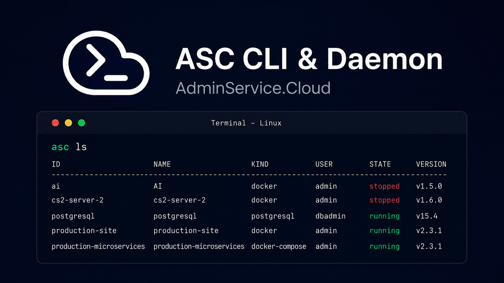

# 🦀 asc-daemon — overview

> 🌍 **Language:** English · [🇷🇺 Русская версия](../russian/README.md)



## 📌 Description

Open source CLI utility and daemon written in Rust, installed on the user's server. Works standalone (a fully-featured tool via the CLI) and as an agent of the AdminService.Cloud platform. Repository: `asc-daemon`.

## ✨ Features

| Module | Doc |
|---|---|
| 📡 API: gRPC (ConnectRPC) + REST, tokens | [api](api.md) |
| 📱 Application management (Docker + native) and CLI | [app-management](app-management.md) |
| 📦 Package manager (`asc.yaml`, registries, `asc install`) | [package-manager](package-manager.md) |
| 🤖 MCP server for AI | [mcp-server](mcp-server.md) |
| 📊 System and application monitoring | [monitoring](monitoring.md) |
| 💾 Application backups | [backups](backups.md) |
| 📁 Per-application SFTP server | [sftp](sftp.md) |
| 🖥️ WebSocket and SSH consoles | [console](console.md) |
| ⏰ Task scheduler | [scheduler](scheduler.md) |
| 🔄 The asc-updater update utility | [updater](updater.md) |

Community files: [🛡️ SECURITY.md](../../SECURITY.md) — security policy and private vulnerability reports; [🤝 CODE_OF_CONDUCT.md](../../CODE_OF_CONDUCT.md) — code of conduct (Contributor Covenant 2.1); [version.txt](../../version.txt) — current version (kept in sync with `Cargo.toml`); [CODEOWNERS](../../.github/CODEOWNERS) — automatic PR review by [@statebyte](https://github.com/statebyte).

## 🏗️ Architecture

```
🦀 asc-daemon
├── proto/            # 📜 proto contracts of the daemon API — the source of truth (linked by the platform)
├── src/              # 🦀 all daemon sources
│   ├── cli/          # asc <commands> — talks to the daemon over a local socket
│   ├── daemon/       # systemd service
│   │   ├── api/      # API: ConnectRPC (proto/) + REST transport from the same contracts
│   │   ├── tunnel/   # outbound connection to nodeservice (works behind NAT)
│   │   ├── apps/     # drivers: docker, systemd, process
│   │   ├── pkg/      # package manager + registries
│   │   ├── mcp/      # MCP server
│   │   ├── backup/ monitor/ sftp/ console/ scheduler/
│   │   ├── i18n/     # translation system for command output (EN/RU)
│   │   └── config/   # /etc/asc/config.toml
│   └── updater/      # 🔄 asc-updater — a separate update binary (see updater.md)
├── skills/           # 🧠 Agent Skills for Claude Code and other models (SKILL.md)
├── docs/             # 📚 module documentation (english/ + russian/)
├── .github/          # ⚙️ workflows (CI, Release), issue/PR templates
├── CONTRIBUTING.md   # 🤝 contribution rules
├── LICENSE           # 📄 MIT with mandatory attribution
├── Taskfile.yml      # 🛠️ development, build, cross-compilation and release commands
└── install.sh        # one-command install (installs asc-updater, which installs the daemon)
```

- **Proto contracts**: the daemon API is described by protobuf contracts **in this repository** (the `proto/` directory) — the daemon is open source and its contracts are public together with it. The AdminService.Cloud platform **links the contracts from here** (a buf dependency) and generates its clients from them; the daemon's Rust code is generated from the same `.proto` files (prost/tonic). One source of truth — always compatible schemas.
- **REST transport**: besides ConnectRPC the daemon serves a **REST API** (JSON over HTTP: `GET/POST/DELETE /v1/...`) — both transports run **simultaneously on one HTTP server** and call the same service layer. REST routes are derived from the same proto contracts (a mapping in the style of `google.api.http` annotations), so the schemas never drift apart; authentication and visibility rules are shared by both transports (DMN-005).
- **Platforms**: first-class support — **Debian and Ubuntu**; the architecture is designed with other distributions (CentOS/RHEL, Fedora, Arch, etc.) and macOS in mind — everything distro-specific hides behind abstractions. Architectures: x86_64, ARM64, ARMv7.
- **Service management**: the daemon's API service is run through systemd by the daemon's own commands — `asc service install|start|stop|restart|status` (install creates a systemd unit and enables autostart).
- **Autonomy**: the daemon fully works without the platform (CLI + local API) — this is fundamental to its open source value.
- **Connecting to the platform**: `asc connect <token>` — an outbound connection to nodeservice, mTLS after registration.
- **Localization**: the language setting is stored in the config (`language` in `/etc/asc/config.toml`), chosen at install time and changed with `asc config lang en|ru` — it affects the output of all commands through the translation system (`src/daemon/i18n/`); debug messages are not translated.
- **Debug logging**: `asc config debug on|off` toggles `[log] level` between `debug` and `info` in `config.toml` (`RUST_LOG` still overrides it); every command initializes tracing, not just `asc serve`, so e.g. `asc install` streams Docker image-pull progress to stderr — useful when a long install looks stuck with no output.
- **Updates**: a separate utility, [🔄 asc-updater](updater.md) — auto-updates (can be disabled), stable/beta channels, rollback; at install time it shows the default settings and asks: install with them or change.

## 🔗 Related tasks

DMN-001…DMN-020 in [ROADMAP.md](../../../asc-platform/ROADMAP.md); GRW-005 in [ROADMAP-GROWTH.md](../../../asc-platform/ROADMAP-GROWTH.md).
